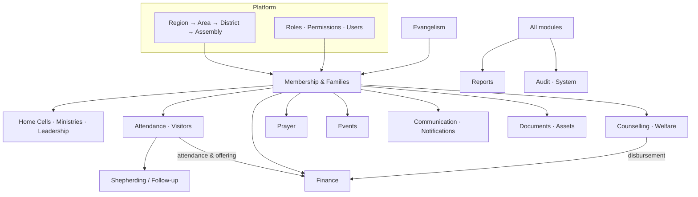
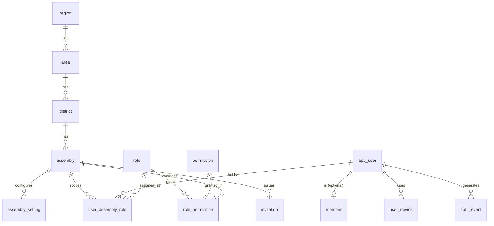
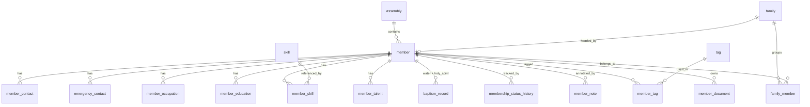
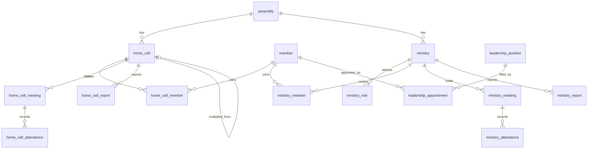
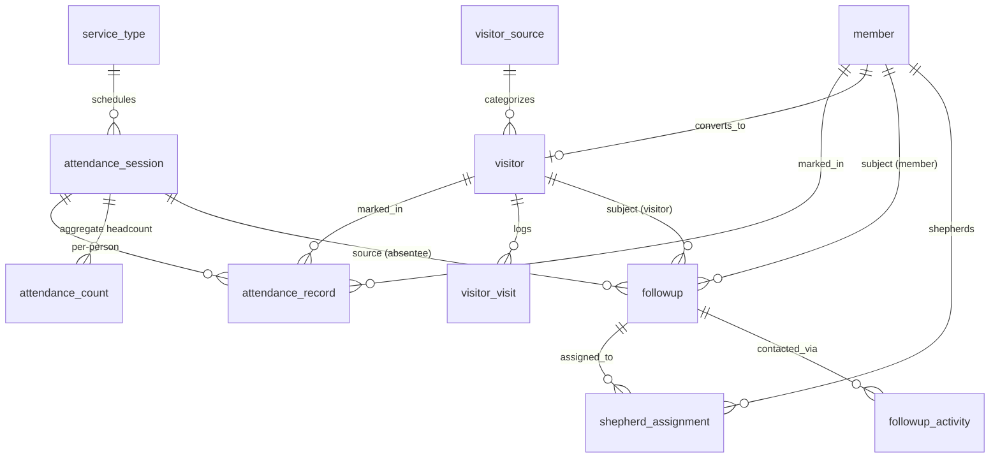
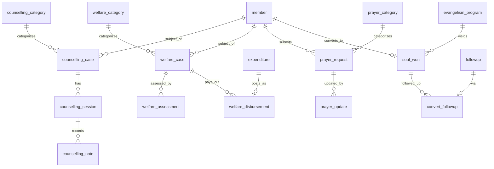
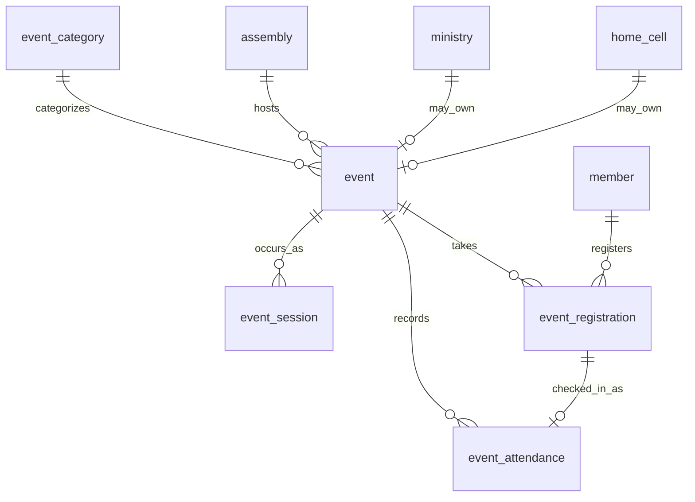
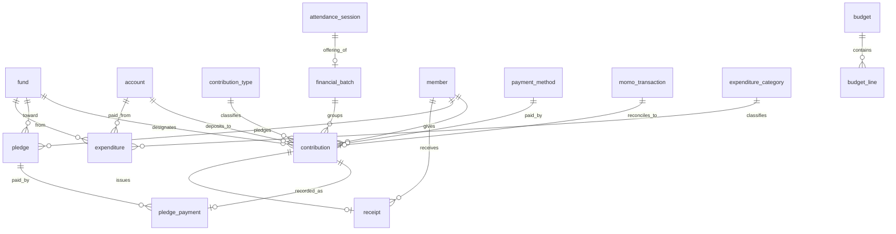
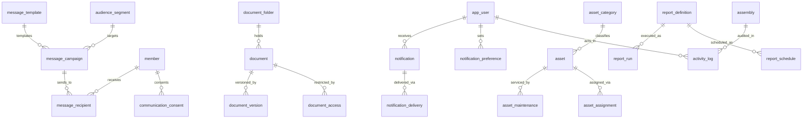

# 06 — Entity Relationship Diagram

> **Artifact:** The data model as diagrams. One big ERD of ~112 tables is
> unreadable, so this is split into a **context map** plus per-domain ERDs.
> Cardinality: `||--o{` = one-to-many, `}o--o{` = many-to-many (via link table),
> `||--o|` = one-to-zero/one. Full column detail is in [`docs/schema/`](./schema).
> **Owner:** Database Architect. **Status:** Phase 2 — in review.

---

## 1. Context map — how the domains connect

**Reading it:** every domain hangs off `Assembly` (the tenant) and `member`.
Attendance feeds both Shepherding (absentees → follow-ups) and Finance (service
offerings). Welfare disbursements post into Finance. Everything writes to Audit.

---

## 2. Platform, Identity & RBAC

The **configurable permission matrix** is `role_permission` (role × permission,
with an optional per-assembly override row). `user_assembly_role` is what stamps
the JWT and drives RLS.

---

## 3. Membership & Families

Note `member` and `app_user` are **separate** (a person vs. a login), linked
1:0..1 — the backbone of the restricted member self-service role.

---

## 4. Home Cells, Ministries & Leadership

---

## 5. Attendance, Visitors & Shepherding

The **pastoral-care queue** on the dashboard is a query over `followup` (open,
by priority). Absentee sweeps and new visitors auto-create follow-ups.

---

## 6. Counselling, Welfare, Prayer & Evangelism

Counselling & Welfare are **confidential** (shaded by RLS): explicit permission
required to even read.

---

## 7. Events

---

## 8. Finance

**MoMo-first, channel-agnostic:** `contribution.channel` covers momo/cash/bank;
`momo_transaction` is the reconciliation ledger that live webhooks will feed
later without reshaping anything.

---

## 9. Communication, Notifications, Documents, Assets & System

---

### Validation note

These diagrams are the human view; the **authoritative** schema is the DDL in
[`docs/schema/`](./schema). Before Phase 3, we'll load the DDL into a local
Supabase instance to confirm every FK, index, and RLS policy compiles and that
the cross-assembly isolation tests pass.
