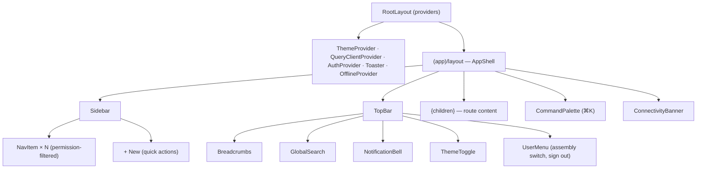
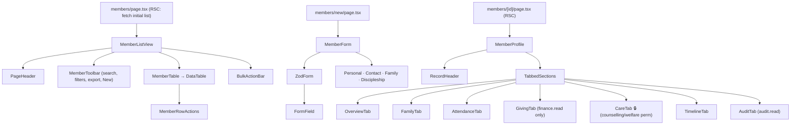

# 12 — Component Hierarchy

> **Artifact:** How the UI decomposes into components — the shared shell, the
> reusable primitives, and the uniform per-module tree. **Owner:** Frontend lead.
> **Status:** Phase 4 — in review.

---

## 1. Three tiers of components

```
1. UI primitives     components/ui/*        shadcn-owned, module-agnostic, dumb
2. Shared composites components/shared/*     app-wide patterns (DataTable, PageHeader)
3. Module components modules/<m>/components/* feature UI, may use hooks/services
```

Rule: **dependencies point down.** Module components use shared + primitives;
shared use primitives; primitives use nothing app-specific. A module never
imports another module's components — only its public `index.ts` (data/hooks).

## 2. App shell tree



## 3. Shared composite components (built once)

```
components/shared/
├── page/            PageHeader, PageTitle, Breadcrumbs, ActionBar
├── data-table/      DataTable, Column defs, ColumnFilter, DensityToggle,
│                    Pagination, BulkActionBar, RowActions
├── form/            FormField, FormSection, FormActions, ZodForm wrapper,
│                    PhoneInput(+233), MoneyInput(GHS), GhanaDatePicker,
│                    MemberCombobox, TagInput, FileDrop
├── feedback/        Skeleton set, EmptyState, ErrorState, ConfirmDialog,
│                    UndoToast, InlineError
├── display/         StatTile, StatusBadge, Avatar, Timeline, DetailGrid,
│                    RecordHeader, ExportMenu (PDF/Excel/CSV/Print)
├── charts/          LineChart, BarChart, AreaChart, DonutChart, ChartCard
│                    (each renders an accessible <table> fallback)
└── layout/          Sheet, Drawer, TabbedSections, Stepper, SplitView
```

These are what make 24 modules feel identical. A new module wires data into
`DataTable` + `PageHeader` + `ZodForm` and inherits the whole UX.

## 4. Uniform module component tree (every module looks like this)

Example — **Membership**:



- **Server Components** fetch initial data (fast first paint, SEO-irrelevant but
  perf-relevant); **Client Components** handle interactivity (tables, forms,
  optimistic mutations).
- Permission-gated tabs/sections simply don't render without the permission —
  belt-and-braces with RLS.

## 5. Client vs Server component split (the rule)

| Server Component (default) | Client Component (`"use client"`) |
|---|---|
| Page shells, initial data fetch | Forms (RHF), DataTable interactivity |
| Static detail sections | Anything with state/effects/handlers |
| Layouts, breadcrumbs | CommandPalette, filters, optimistic mutations |
| Report/table first render | Charts (Recharts), toasts, dialogs |

Default to Server Components; drop to Client only at the leaves that need
interactivity. This keeps JS shipped to the phone minimal.

## 6. Naming & file conventions (recap from doc 03)

- Components `PascalCase.tsx`; one component per file; co-locate a `*.test.tsx`.
- Module UI lives in `modules/<m>/components/`; only `index.ts` is public.
- Shared props types derive from Zod schemas / DB types — no hand-duplicated types.
- Every interactive component: keyboard support, `aria-*`, loading + disabled
  states, and a documented prop contract.
