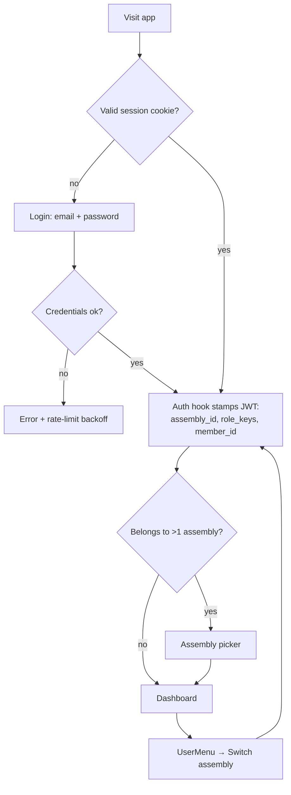
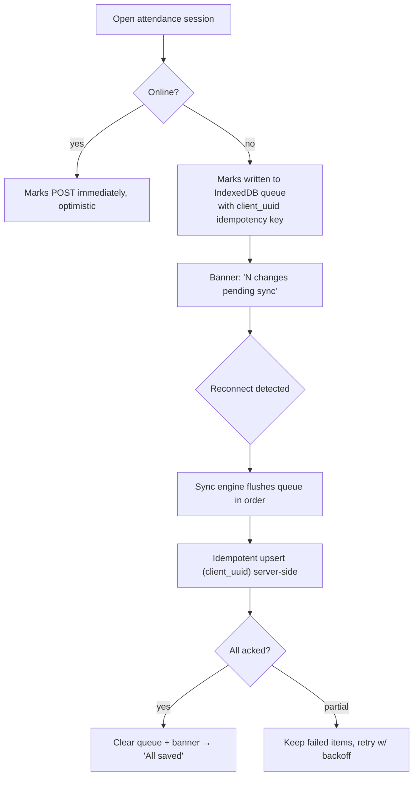
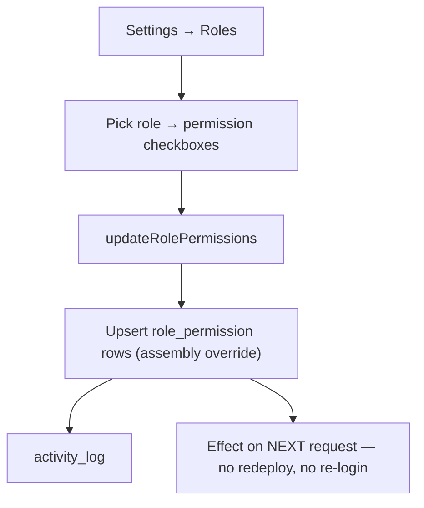

# 13 — User Flows & State Management

> **Artifact:** The critical end-to-end journeys, plus the strategy for every kind
> of state in the app. **Owner:** UX + Frontend lead. **Status:** Phase 4 — in review.

---

## Part A — Key user flows

### A1. Authentication & tenant context



### A2. Add a member (create + optimistic)

```mermaid
flowchart TD
  A["Members → + New"] --> F[MemberForm: RHF + Zod]
  F --> C{Client valid?}
  C -- no --> FE[Inline field errors]
  C -- yes --> O[Optimistic row inserted + toast 'Saving…']
  O --> SA["createMember server action"]
  SA --> Z{Server Zod + permission ok?}
  Z -- no --> R[Rollback optimistic + show error + requestId]
  Z -- yes --> DB[Service → repo → INSERT (RLS) → activity_log]
  DB --> INV[Invalidate members query] --> G[Row confirmed + go to profile]
```

### A3. Mark attendance offline → sync (the resilience flow)



### A4. Absentee → follow-up → shepherd (the pastoral loop)

```mermaid
flowchart TD
  CRON[Nightly absentee sweep (Railway)] --> DET[Members absent ≥ N weeks]
  DET --> FU[Create followup: reason=absent_Nwk, priority]
  FU --> QUE[Appears in Shepherding queue + dashboard]
  QUE --> ASG[Leader assigns shepherd]
  ASG --> NOTE[Shepherd logs call/visit/SMS]
  NOTE --> RES{Restored?}
  RES -- yes --> CLOSE[Close follow-up: outcome]
  RES -- no --> ESC[Escalate priority / reassign]
```

### A5. Record contribution & reconcile MoMo

```mermaid
flowchart TD
  A[Finance → New contribution] --> E[Enter: member, type, channel=MoMo, amount, ref]
  E --> SAVE[recordContribution → activity_log] --> RCPT{Issue receipt?}
  RCPT -- yes --> SMS[SMS/email receipt via provider]
  subgraph Later — live integration (designed, deferred)
    WH[MoMo webhook] --> IDEM["webhook_event unique (provider, external_id)"]
    IDEM --> TX[Upsert momo_transaction]
    TX --> MATCH[Auto-match to contribution.reference]
    MATCH --> REC[Mark reconciled]
  end
```

### A6. Configure a role's permissions (runtime RBAC)



---

## Part B — State management strategy

We classify every piece of state and give each **one** home. The #1 mistake in
apps this size is dumping everything into one global store; we don't.

| State kind | Examples | Home | Tool |
|---|---|---|---|
| **Server state** | members, attendance, contributions, dashboard aggregates | Server cache, per-query | **TanStack Query** |
| **Form state** | create/edit forms, filters-as-forms | Local to the form | **React Hook Form + Zod** |
| **URL state** | filters, search `q`, pagination cursor, active tab | The URL (shareable, back-button-safe) | `searchParams` / `nuqs`-style |
| **Global client state** | theme, sidebar collapsed, active assembly, density | App-wide, tiny | **Zustand** (one small store) |
| **Offline queue** | pending attendance/notes while offline | IndexedDB + sync engine | **`lib/offline`** |
| **Ephemeral UI** | dialog open, hover, focus | The component | `useState` |
| **Auth/session** | user, claims, permissions | Server (cookies) + context | **AuthProvider** (reads server session) |

### B1. Server state — TanStack Query (the backbone)

- **Query-key factory** per module for predictable invalidation:
  `queryKeys.members.list(filters)`, `queryKeys.members.detail(id)`.
- **Mutations** do optimistic updates + rollback on error, then invalidate the
  affected keys (see flow A2).
- **Offline-aware:** `networkMode` tuned so reads serve from cache and writes
  retry; pairs with the IndexedDB queue for the attendance flow.
- **Prefetching:** RSC fetches initial list/detail on the server and hydrates the
  Query cache → instant first paint, no loading flash.
- **Stale-while-revalidate** defaults; background refetch on focus/reconnect.

### B2. Forms — React Hook Form + Zod

- The **same Zod schema** validates client and server (`schemas/` in each module).
- Field-level errors map to the `fieldErrors` in the `ActionResult` envelope, so
  server validation failures render inline too.
- Long forms autosave drafts (localStorage) to survive a dropped connection.

### B3. URL as state

- Filters, search, sort, pagination, and active tab live in the URL. This makes
  every view **shareable and bookmarkable** ("here's the absentee list"), keeps
  the back button correct, and means no client store to keep in sync.

### B4. Global store — deliberately tiny (Zustand)

Only truly cross-cutting, non-server UI state: `theme`, `sidebarCollapsed`,
`density`, `activeAssemblyId` (mirrors the JWT claim), `pendingSyncCount`. That's
it. Everything else has a better home above.

### B5. Offline sync engine (`lib/offline`)

```
enqueue(mutation, client_uuid)  → IndexedDB
onReconnect → drain queue in FIFO → idempotent server upsert → on ack, dequeue
             → on fail, keep + exponential backoff → update pendingSyncCount
```

Idempotency keys (`client_uuid`) make replays safe; the UI always reflects the
true sync state (never a false "saved").

### B6. Auth/permission state

- The server owns the session (cookies). `AuthProvider` exposes
  `{ user, claims, can(permission) }` to the tree; `can()` reads the same matrix
  RLS enforces. UI hides what you can't do; the server + RLS still guarantee it.

---

## Part C — Performance budget (how these choices pay off)

- RSC + minimal client JS → fast first paint on mid-range Android.
- Virtualized tables → 10k-row member lists scroll smoothly.
- Query cache + prefetch → navigation feels instant.
- Skeletons matched to layout → zero layout shift (good CLS).
- Offline queue → attendance never lost on flaky data.
- Target: **P75 interactive < 2.5s on 3G**, Lighthouse PWA/Perf/A11y all green.
